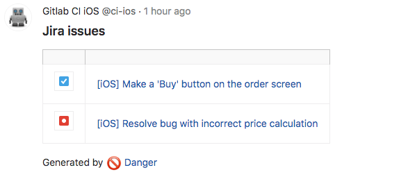

# danger-jira_issue_links
### Plugin for [Danger](https://danger.systems/)

This plugin collects issue mentions from git commit messages and obtains info from Jira issue tracker.<br>

By default, commit message should start with pattern `[TASK-123]` ([this can be configured](https://github.com/RedMadRobot/danger-jira_issue_links#usage)), where TASK is Jira project Id and 123 is issue number.    
For example, for commit message:
```
[JSGLK-1145] Resolve bug with incorrect price calculation
```
Results are passed out as a table in the Danger comment for merge request.




## Installation

If you use Bundler, add next line to `Gemfile` and execute `bundle install`

    gem 'danger-jira_issue_links'

Or install manually

    $ gem install danger-jira_issue_links

## Usage

In `Dangerfile` add next lines:

Configure connection to you Jira instance

```
jira_issue_links.jira_username = "email"
jira_issue_links.jira_password = "password"
jira_issue_links.jira_site = "https://your-company.atlassian.net"
```

You can configure regexp that finds `issue id` in commit messages. 

For example - issue id can be anywhere in message, but it starts with `TASK-`
```
Fix bug as per TASK-1234
```
```
jira_issue_links.issue_number_regexp = /(TASK-\d+)/
```
By [default](https://github.com/RedMadRobot/danger-jira_issue_links#plugin-for-danger) it is set to `/^\[(\w+-\d+)\]/` 


The `include_resolves_keyword` option adds phrase `Resolves TASK-123` in output report.
It allows GitLab Jira plugin to automatically close issues (see: [GitLab Jira integration](https://docs.gitlab.com/ee/user/project/integrations/jira.html#closing-jira-issues)).
```
jira_issue_links.include_resolves_keyword = true
```


Find all issue mentions in commit messages, obtain info from Jira and make table of links
```
jira_issue_links.print_links_with_titles
```

Find all issue mentions in commit messages and make links. <br>
Not required access to Jira, needs only base url - `jira_site`.
```
jira_issue_links.print_links_only
```


## Development

1. Clone this repo
2. Run `bundle install` to setup dependencies.
3. Run `bundle exec rake spec` to run the tests.
4. Use `bundle exec guard` to automatically have tests run as you make changes.
5. Make your changes.
